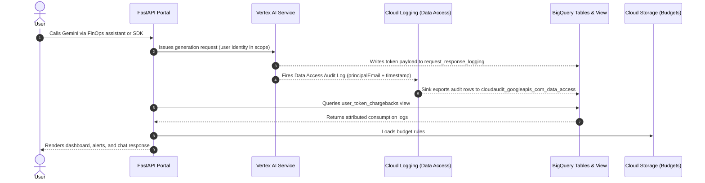

# Vertex AI User-Level Consumption Portal: New Environment Runbook

This runbook walks a brand-new operator through every step required to deploy the **Vertex AI User-Level Consumption and FinOps Portal** in a fresh Google Cloud Platform project — from cloning the repository to seeing a real caller's email appear in the dashboard.

Estimated time: **45–60 minutes of active work** plus up to **20 minutes of GCP propagation waits** (audit-log export, first BigQuery table appearance).

Prefer a guided experience? Open [setup-guide.html](setup-guide.html) in your browser — same steps with your values substituted into every command.

---

## What You'll Build

The portal attributes Vertex AI token consumption and estimated costs to individual principals by correlating two GCP-native telemetry streams — no agent-side instrumentation required:

| Stream | BigQuery table | Created by |
|---|---|---|
| Vertex AI payload logs (tokens, model, latency) | `request_response_logging` | Vertex AI automatically on first logged call |
| Data Access audit logs (caller email, timestamp) | `cloudaudit_googleapis_com_data_access` | Cloud Logging sink on first matched export (5–15 min) |
| Correlated logical view | `user_token_chargebacks` | `setup_bigquery_view.py` — run twice |

Both raw tables are created automatically; you never create them by hand. The `user_token_chargebacks` view correlates them by time-window (±10 s, same model) because there is no shared key between the two streams.



---

## Prerequisites

### Billing

The GCP project must have a **linked billing account** before Step 3. API enablement and Vertex AI calls both fail (with cryptic `403` errors) if billing is not active.

```bash
# Check whether billing is enabled before proceeding
gcloud billing projects describe $PROJECT_ID --format="value(billingEnabled)"
# Expected output: True
```

### Tools

| Tool | Minimum version | Why |
|---|---|---|
| [Google Cloud SDK (`gcloud`)](https://cloud.google.com/sdk/docs/install) | Any recent | All GCP infra commands |
| [Python](https://www.python.org/downloads/) | 3.11+ | Matches the `python:3.11-slim` base in the Dockerfile; required for backend and setup scripts |
| [Node.js + npm](https://nodejs.org/) | 18+ | Builds the React frontend |
| Docker | Any recent | Optional — only needed for containerised deploy (Step 10) |

### GCP IAM permissions

The operator running this guide needs the following roles (or `roles/owner`) on the target project:

| Purpose | Minimum role |
|---|---|
| Enable APIs | `roles/serviceusage.serviceUsageAdmin` |
| Manage Cloud Logging sinks | `roles/logging.admin` |
| Create BigQuery datasets and run DDL | `roles/bigquery.admin` |
| Create GCS buckets | `roles/storage.admin` |
| Call Vertex AI / set payload logging | `roles/aiplatform.admin` |
| Apply project IAM audit config | `roles/iam.securityAdmin` |

> **Shortcut for new projects:** `roles/owner` covers all of the above.

---

## Step 0: Clone the Repository

```bash
git clone https://github.com/mlaslie/geap-model-consumption-dashboard.git
cd vertex-ai-token-consumption
```

Replace `<your-org>` with the actual GitHub organization or username where the repo lives.

---

## Step 1: Authenticate with Google Cloud

```bash
# Authenticate your CLI identity (opens a browser)
gcloud auth login

# Authenticate Application Default Credentials — used by the backend
# locally for BigQuery, GCS, and Vertex AI calls
gcloud auth application-default login

# Set your project ID and export it for use in later commands
export PROJECT_ID="your-gcp-project-id"
gcloud config set project $PROJECT_ID
```

**Why ADC matters:** The Python backend (`backend/config.py`, `bq_client.py`, `gcs_client.py`, `ai_assistant.py`) authenticates with GCP using the Application Default Credentials chain — not a service account key file. Running `gcloud auth application-default login` provisions the credentials that the SDK picks up automatically when you run the app locally. Without this step you will see `DefaultCredentialsError` at runtime.

> **Verify:**
> ```bash
> gcloud config get-value project
> # Expected output: your-gcp-project-id
> gcloud auth application-default print-access-token | head -c 20
> # Expected output: ya29.… (a partial token — proves ADC is active)
> ```

---

## Step 2: Install Python Dependencies

Create a virtual environment and install all Python dependencies **now** — before any `python` script runs. `enable_audit_logs.py`, `setup_bigquery_view.py`, and `trigger_call.py` all import packages installed here (including `python-dotenv`).

```bash
python3 -m venv .venv
source .venv/bin/activate
pip install -r requirements.txt
```

`requirements.txt` installs everything needed for the backend and all setup scripts, including `google-cloud-bigquery`, `google-cloud-aiplatform`, and `python-dotenv`.

> **After activation, the shell `python` command refers to the virtualenv interpreter.** All remaining steps use `python` (not `python3`) for scripts run from this repo.

> **Verify:**
> ```bash
> python --version
> # Expected output: Python 3.11.x (or your installed 3.11+ version)
> python -c "import dotenv; print('dotenv OK')"
> # Expected output: dotenv OK
> ```

---

## Step 3: Enable Core APIs

```bash
gcloud services enable \
    aiplatform.googleapis.com \
    bigquery.googleapis.com \
    storage.googleapis.com \
    logging.googleapis.com \
    run.googleapis.com \
    cloudbuild.googleapis.com \
    artifactregistry.googleapis.com
```

API enablement can take 1–2 minutes. You can confirm with:

> **Verify:**
> ```bash
> gcloud services list --enabled | grep -E "aiplatform|bigquery.googleapis|logging.googleapis"
> # Expected output (NAME and TITLE columns):
> # aiplatform.googleapis.com      Vertex AI API
> # bigquery.googleapis.com        BigQuery API
> # logging.googleapis.com         Cloud Logging API
> ```

---

## Step 4: Enable Vertex AI Data Access Audit Logs

Data Access audit logs record which principal (email) made each Vertex AI call. Without them every token row shows up as `unattributed@unknown`.

### Option A — Automated script (recommended)

The script reads `BIGQUERY_PROJECT_ID` or `PROJECT_ID` from the environment, fetches the existing IAM policy, and **merges** only the Vertex AI audit config into the `auditConfigs` array — other services' audit settings are preserved.

```bash
export BIGQUERY_PROJECT_ID="$PROJECT_ID"
python enable_audit_logs.py
```

Expected output:
```
Fetching current IAM policy...
WARNING: `gcloud projects set-iam-policy` replaces the FULL project IAM policy...
Applying updated policy from temporary file ...
SUCCESS: Data Access Audit Logs have been successfully enabled for Vertex AI API!
```

### Option B — Manual (if you prefer to apply by hand)

1. Export the current policy to a **temporary path outside the repo**:
   ```bash
   gcloud projects get-iam-policy $PROJECT_ID --format=json > /tmp/iam_policy.json
   ```

   > **Warning:** Always write the policy export to `/tmp/` or another path outside the repository. The repo historically contained a committed `iam_policy.json` — never reuse it; it belongs to a different project and applying it would replace your entire project IAM policy with stale bindings from another account.

2. Open `/tmp/iam_policy.json` and **merge** the following entry into the existing `auditConfigs` array. Do not replace the whole array — doing so clears audit logging for any other services already configured:
   ```json
   {
     "service": "aiplatform.googleapis.com",
     "auditLogConfigs": [
       { "logType": "DATA_READ" },
       { "logType": "DATA_WRITE" },
       { "logType": "ADMIN_READ" }
     ]
   }
   ```

3. Apply the updated policy:
   ```bash
   gcloud projects set-iam-policy $PROJECT_ID /tmp/iam_policy.json
   ```

   > **Warning:** `gcloud projects set-iam-policy` replaces the **entire** project IAM policy in one atomic write. Do not run it concurrently with other IAM changes — the last writer wins and intermediate edits will be silently lost.

> **Verify:**
> ```bash
> gcloud projects get-iam-policy $PROJECT_ID --format=json \
>   | python3 -c "import sys,json; p=json.load(sys.stdin); \
>     [print(c) for c in p.get('auditConfigs',[]) if c['service']=='aiplatform.googleapis.com']"
> # Expected output: the aiplatform.googleapis.com entry with DATA_READ, DATA_WRITE, ADMIN_READ
> ```

---

## Step 5: Create BigQuery Dataset and Cloud Logging Sink

### 5a. Create the BigQuery dataset

```bash
bq --location=US mk --dataset \
    --description "Vertex AI Consumption Telemetry" \
    $PROJECT_ID:vertex_ai_user_telemetry
```

> **Verify:**
> ```bash
> bq ls $PROJECT_ID:
> # Expected output: vertex_ai_user_telemetry listed
> ```

### 5b. Create the Cloud Logging sink

The sink routes matching audit log entries into the BigQuery dataset. The filter below is validated to work with Cloud Logging's filter syntax — **`LIKE` is not a Cloud Logging operator; use `:` (contains)**:

```bash
gcloud logging sinks create vertex-ai-telemetry-sink \
    bigquery.googleapis.com/projects/$PROJECT_ID/datasets/vertex_ai_user_telemetry \
    --use-partitioned-tables \
    --log-filter='log_id("cloudaudit.googleapis.com/data_access") AND protoPayload.serviceName="aiplatform.googleapis.com" AND (protoPayload.methodName:"GenerateContent" OR protoPayload.methodName:"Predict")'
```

> **Why this exact filter?** The `log_id(...)` predicate restricts the sink to Data Access logs only (not Admin Activity or System Event logs). The `:` operator means "contains", which matches method name substrings. A filter using SQL `LIKE` syntax will compile silently but match zero entries and the audit table will never appear.

> [!NOTE]
> `--use-partitioned-tables` makes the sink write one partitioned table
> (`cloudaudit_googleapis_com_data_access`). Without the flag, Cloud Logging's
> default creates **date-sharded** tables (`cloudaudit_..._YYYYMMDD`) instead.
> The chargeback view queries a table wildcard, so it works with either mode
> (including pre-existing sharded sinks) — partitioned is simply cheaper to
> query and recommended for new sinks.

### 5c. Grant the sink's writer service account WRITER access on the dataset

GCP Logging uses a dedicated service account to write into BigQuery. You must grant it write access — **without this, exports fail silently: the sink reports nothing, and no table ever appears in BigQuery.** This is the single most commonly missed step.

**Recommended: dataset-level WRITER (least privilege)**

```bash
# Retrieve the sink's writer identity
SINK_SA=$(gcloud logging sinks describe vertex-ai-telemetry-sink \
    --format="value(writerIdentity)")
# writerIdentity is in the form "serviceAccount:service-<num>@gcp-sa-logging.iam.gserviceaccount.com"
SINK_SA_EMAIL="${SINK_SA#serviceAccount:}"

echo "Sink writer identity: $SINK_SA_EMAIL"

# Fetch the current dataset access list to a temp file
bq show --format=prettyjson $PROJECT_ID:vertex_ai_user_telemetry > /tmp/dataset-info.json

# Build the updated access JSON (append the new entry)
python3 - <<'EOF'
import json, os, sys

project = os.environ["PROJECT_ID"]
sa_email = os.environ["SINK_SA_EMAIL"]

with open("/tmp/dataset-info.json") as f:
    info = json.load(f)

access = info.get("access", [])
entry = {"role": "WRITER", "userByEmail": sa_email}
if entry not in access:
    access.append(entry)
    print(f"Adding WRITER entry for {sa_email}")
else:
    print(f"{sa_email} already has WRITER access — no change needed")

with open("/tmp/dataset-access.json", "w") as f:
    json.dump({"access": access}, f)
EOF

# Apply the updated access list
bq update --source /tmp/dataset-access.json $PROJECT_ID:vertex_ai_user_telemetry
echo "SUCCESS: $SINK_SA_EMAIL now has WRITER access on vertex_ai_user_telemetry"
```

**Alternative: project-level grant (simpler but broader)**

If you prefer a single `gcloud` command and are comfortable with project-wide BigQuery data editor access:

```bash
gcloud projects add-iam-policy-binding $PROJECT_ID \
    --member="$SINK_SA" \
    --role="roles/bigquery.dataEditor"
```

### 5d. Validate the sink filter

Run the query below to verify the filter syntax. **If you run it before any Vertex AI call has been made, an empty result is completely normal** — there are no matching log entries yet. Come back to validate it after the first test call in Step 9b.

```bash
gcloud logging read \
  'log_id("cloudaudit.googleapis.com/data_access") AND protoPayload.serviceName="aiplatform.googleapis.com" AND (protoPayload.methodName:"GenerateContent" OR protoPayload.methodName:"Predict")' \
  --limit 1 \
  --freshness 1d
```

After Step 9b, if this returns at least one log entry, the filter is valid. If it still returns nothing while you know calls are being made, the filter is wrong or audit logs are not enabled — revisit Steps 3 and 4 before proceeding.

> **Important:** Sinks are forward-only. Log entries written before the sink was correctly configured are never backfilled into BigQuery. Attribution begins at the moment the sink first successfully exports a matching entry.

> **Verify the sink configuration:**
> ```bash
> gcloud logging sinks describe vertex-ai-telemetry-sink
> # Expected: destination points to your dataset, writerIdentity shows the SA email
> ```

---

## Step 6: Create the GCS Bucket (Recommended)

The portal stores budget rules (`budgets.json`), logging config (`logging_config.json`), and cost estimates (`estimates.json`) in GCS. If you skip this step the app falls back to local files inside the container, which are ephemeral — every restart resets your budget rules.

```bash
export BUCKET_NAME="vertex-ai-finops-$PROJECT_ID"

gcloud storage buckets create gs://$BUCKET_NAME \
    --location=US
```

Standard storage class is the default and does not need to be specified explicitly.

> **Verify:**
> ```bash
> gcloud storage buckets describe gs://$BUCKET_NAME
> # Expected: bucket metadata including location: US
> ```

If you skip GCS, leave `GCS_BUCKET_NAME` empty in `.env`. The app will write to local files — fine for single-instance local dev, not for Cloud Run.

---

## Step 7: Configure the Application Environment

Copy the template and fill in your values:

```bash
cp .env.template .env
```

Open `.env` and set every variable. The annotated reference below covers all variables read by the backend (`backend/config.py`) and the setup scripts:

```ini
# ── Server ──────────────────────────────────────────────────────────────────
PORT=8000
# Port the uvicorn server binds to (used by Dockerfile CMD and Cloud Run)

# ── BigQuery ─────────────────────────────────────────────────────────────────
BIGQUERY_PROJECT_ID=your-gcp-project-id
# Must match the GCP project where you created the dataset in Step 5.
# Also read by setup_bigquery_view.py and enable_audit_logs.py.

BIGQUERY_DATASET=vertex_ai_user_telemetry
# Must match the dataset name you created in Step 5a.

BIGQUERY_VIEW=user_token_chargebacks
# Name of the logical view created by setup_bigquery_view.py.
# Change only if you deliberately chose a different view name.

# ── Cloud Storage ─────────────────────────────────────────────────────────────
GCS_BUCKET_NAME=vertex-ai-finops-your-gcp-project-id
# Replace with the bucket name from Step 6.
# Leave empty to use local file fallback (budgets.json, logging_config.json).
# WARNING: local fallback is ephemeral on Cloud Run — every restart loses edits.

# ── Vertex AI ─────────────────────────────────────────────────────────────────
VERTEX_REGION=global
# Vertex AI endpoint region. "global" routes to the global endpoint (lower pricing).
# Change to a specific region (e.g. "us-central1") only if your policy requires it;
# regional endpoints incur a non_global_multiplier pricing premium.

GEMINI_MODEL=gemini-3.6-flash
# Model used by the built-in FinOps Assistant chat tab.
# Must be a model ID available in your project.

# ── Authentication ────────────────────────────────────────────────────────────
PORTAL_AUTH_TOKEN=
# Bearer token protecting all /api/* endpoints.
# REQUIRED before deploying to any shared or public environment.
# Generate a strong secret: openssl rand -base64 32
# Leaving this empty starts the server in unauthenticated dev mode — all API
# endpoints are open to anyone who can reach the port. A SECURITY WARNING is
# logged at startup when this variable is unset.

# ── Logging behaviour ─────────────────────────────────────────────────────────
APPLY_LOGGING_ON_STARTUP=false
# Set true to re-apply Vertex AI payload logging config on every server boot.
# Useful for ensuring logging stays enabled after model config resets.
# Keep false to avoid hitting the Vertex config API on every restart storm.

LOGGING_SAMPLING_RATE=1.0
# Fraction of Vertex AI requests whose full prompts and responses are written
# to BigQuery (0.0 = none, 1.0 = all). Prompts and completions are real user
# content — lower this before deploying in a privacy-sensitive environment.

# ── CORS ──────────────────────────────────────────────────────────────────────
CORS_ALLOW_ORIGINS=http://localhost:5173,http://127.0.0.1:5173
# Comma-separated list of allowed browser origins.
# This setting only matters for cross-origin setups — for example, running
# `npm run dev` (port 5173) against a separate API server.
# For the standard single-port deployment where FastAPI serves the compiled React
# SPA, the browser and API share the same origin and CORS middleware is a no-op;
# you can leave the default as is.

# ── Fallback identity ─────────────────────────────────────────────────────────
# FALLBACK_IDENTITY=unattributed@unknown
# Email placeholder used by setup_bigquery_view.py for rows that cannot be
# correlated to an audit log entry. Defaults to "unattributed@unknown" if unset.
# Change only if you want a different label in the dashboard.
```

---

## Step 8: Build the Frontend and Start the Portal

### 8a. Build the React frontend

```bash
cd frontend
npm install
npm run build
cd ..
# Output goes to backend/static/ — FastAPI serves it from there
```

### 8b. Start the FastAPI portal

```bash
uvicorn backend.main:app --host 127.0.0.1 --port 8000
```

Open **http://127.0.0.1:8000** in a browser.

If `PORTAL_AUTH_TOKEN` is set, a token modal will appear on first load — enter the token value from your `.env`.

---

## Step 9: Enable Payload Logging, Make a Test Call, and Set Up BigQuery Views

Follow these sub-steps **in order**. The BigQuery view cannot be created until `request_response_logging` exists, and that table is only created automatically by Vertex AI after the first logged call completes.

### 9a. Enable Vertex AI payload logging

The `request_response_logging` table in BigQuery is created **automatically by Vertex AI** the first time you make a call with payload logging enabled. You do not create this table by hand.

To enable payload logging:

1. Open the portal and navigate to the **Model Logging** tab (or `#logging` hash).
2. Tick the model matching your `GEMINI_MODEL` setting (e.g. `gemini-3.6-flash`).
3. Click **"Apply Logging Settings"**.

> **Important:** The default logging config in the repo pre-checks `gemini-2.5-pro`. If your `GEMINI_MODEL` is a different model (such as `gemini-3.6-flash`), you **must** manually tick that model in the UI before clicking Apply — unticked models are not logged and `request_response_logging` rows for those models will never appear.

The portal calls the Vertex AI SDK to register the payload sink. The UI shows per-model success or failure. A 409 "already active" response is treated as success — the config is already applied.

**Alternative — script-based enable (if the portal is not yet running):**
```bash
python enable-logging.py
```

### 9b. Make a test call to trigger both telemetry streams

```bash
python trigger_call.py
```

Expected output (model name follows `GEMINI_MODEL` in your `.env`):
```
Initializing Vertex AI...
Loading model gemini-3.6-flash...
Sending generate_content request...
Response text: Hello! I'm Gemini, ...
Trigger completed successfully!
```

This single call triggers both:
- A write to `request_response_logging` (token payload — appears within seconds)
- A Data Access audit log entry (caller identity — exported to BigQuery in 5–15 minutes)

### 9c. Wait for `request_response_logging` to appear (usually < 2 min)

```bash
bq ls $PROJECT_ID:vertex_ai_user_telemetry
```

Re-run every ~30 seconds until `request_response_logging` appears:
```
tableId                    Type
request_response_logging   TABLE
```

If it does not appear after 5 minutes, confirm that payload logging was enabled for the correct model in Step 9a and that the test call in Step 9b completed without errors.

Once `request_response_logging` is visible, re-run the sink filter validation from Step 5d to confirm audit entries are flowing:

```bash
gcloud logging read \
  'log_id("cloudaudit.googleapis.com/data_access") AND protoPayload.serviceName="aiplatform.googleapis.com" AND (protoPayload.methodName:"GenerateContent" OR protoPayload.methodName:"Predict")' \
  --limit 1 \
  --freshness 1d
```

If this returns at least one entry, your audit logs and sink filter are working correctly.

### 9d. First run of `setup_bigquery_view.py` → fallback view (expected)

```bash
python setup_bigquery_view.py
```

**What to expect on a fresh environment:**

The script first tries to create the full time-correlation view that joins `request_response_logging` with `cloudaudit_googleapis_com_data_access`. Because the audit table does not yet exist (the sink is still buffering the first export), the script detects this and falls back to creating a simpler view that reads `request_response_logging` directly:

```
Attempting to create/update BigQuery view 'user_token_chargebacks' with FULL audit log join...
[WARNING] cloudaudit_googleapis_com_data_access table not found in BigQuery yet.
This is expected if the first Data Access log is still being routed/buffered by GCP Logging.
Creating the view with highly-resilient FALLBACK schema (using request_response_logging directly)...
SUCCESS: Fallback view 'user_token_chargebacks' created successfully!

NOTE: The fallback view now includes pricing_tier and region columns (per model+tier+day grain; region is always 'global'). Existing deployments MUST re-run this script so that bq_client can apply context-tier pricing correctly.
```

This is normal and expected. The portal is now functional. Token usage will be visible in the dashboard, but all rows will show the fallback identity (`unattributed@unknown`) instead of real user emails.

> **Verify:**
> ```bash
> bq show $PROJECT_ID:vertex_ai_user_telemetry.user_token_chargebacks
> # Expected: view metadata including schema with user_email, model_name, etc.
> ```

### 9e. Wait for the audit table (5–15 min)

Wait 5–15 minutes for the Cloud Logging sink to export the audit entry. Then check whether the table has appeared:

```bash
bq ls $PROJECT_ID:vertex_ai_user_telemetry
```

Expected output once the sink has exported at least one entry:
```
tableId                                   Type
cloudaudit_googleapis_com_data_access     TABLE
request_response_logging                  TABLE
user_token_chargebacks                    VIEW
```

### 9f. Second run → full attribution view

Once `cloudaudit_googleapis_com_data_access` appears, re-run the view script to upgrade from the fallback schema to the full time-correlation join:

```bash
python setup_bigquery_view.py
```

Expected output:
```
Attempting to create/update BigQuery view 'user_token_chargebacks' with FULL audit log join...
SUCCESS: Created view 'user_token_chargebacks' successfully using full Data Access Audit Log join!

NOTE: The view now includes pricing_tier and region columns (per user+model+tier+region+project+day grain). Existing deployments MUST re-run this script so that bq_client can apply context-tier and endpoint-region pricing correctly.
```

### 9g. Verify end-to-end attribution

Restart the portal if it is still running (the view schema changed), then check attribution.

First, load `PORTAL_AUTH_TOKEN` from your `.env` into your shell. The `.env` file is read by the app process — your shell does **not** automatically inherit it:

```bash
# Option A: export the token manually
export PORTAL_AUTH_TOKEN=<the value you put in .env>

# Option B: source all variables from .env into the current shell
set -a; source .env; set +a
```

Then call the API:

```bash
curl -s -H "Authorization: Bearer $PORTAL_AUTH_TOKEN" \
    http://127.0.0.1:8000/api/usage | python3 -m json.tool | head -30
```

**Expected output — before the second view-script run (fallback schema):**
```json
{
  "status": "success",
  "data": [
    {
      "user_email": "unattributed@unknown",
      "model_name": "gemini-3.6-flash",
      "..."
    }
  ]
}
```

**Expected output — after the second view-script run (full join):**
```json
{
  "status": "success",
  "data": [
    {
      "user_email": "your-email@example.com",
      "model_name": "gemini-3.6-flash",
      "input_tokens": 14,
      "output_tokens": 42,
      "total_tokens": 56,
      "call_count": 1,
      "..."
    }
  ]
}
```

> **Note:** `model_name` in the output reflects whichever model is set as `GEMINI_MODEL` in your `.env`.

Your real caller email appearing in `user_email` confirms the full pipeline is working: audit logs enabled, sink filter correct, writer permission granted, view upgraded.

The dashboard at `http://127.0.0.1:8000` will now show the attributed email in the per-user table on the **Dashboard Overview** tab.

---

## Step 10 (Optional): Docker / Cloud Run Deployment

### 10a. Build and run locally with Docker

```bash
docker build -t vertex-ai-consumption-portal .
docker run -p 8000:8000 --env-file .env vertex-ai-consumption-portal
```

The Dockerfile is a two-stage build: `node:20-alpine` compiles the React frontend, then `python:3.11-slim` packages the FastAPI backend with the compiled static assets at `backend/static/`.

### 10b. Deploy to Cloud Run (authenticated — recommended)

#### Operator roles required to deploy

In addition to the roles in the Prerequisites section, deploying to Cloud Run requires:

| Purpose | Role |
|---|---|
| Deploy Cloud Run services | `roles/run.admin` |
| Act as the runtime service account | `roles/iam.serviceAccountUser` |
| Submit Cloud Build jobs | `roles/cloudbuild.builds.editor` |

#### Build the container image first

The container image must exist in the registry **before** `gcloud run deploy` is called. Build and push it with Cloud Build:

```bash
gcloud builds submit --tag gcr.io/$PROJECT_ID/vertex-ai-consumption-portal
```

#### Grant runtime service account roles

The Cloud Run service account needs the following roles to operate at runtime:

| Runtime need | Minimum role |
|---|---|
| Query BigQuery view | `roles/bigquery.jobUser` + READER on `vertex_ai_user_telemetry` dataset |
| Read/write GCS bucket | `roles/storage.objectAdmin` scoped to the bucket |
| Call Vertex AI (FinOps assistant) | `roles/aiplatform.user` |

Create a dedicated runtime service account and grant roles:

```bash
export RUNTIME_SA="vertex-portal-runtime"
gcloud iam service-accounts create $RUNTIME_SA \
    --display-name "Vertex Portal Cloud Run Runtime"

export RUNTIME_SA_EMAIL="$RUNTIME_SA@$PROJECT_ID.iam.gserviceaccount.com"

# Vertex AI calls
gcloud projects add-iam-policy-binding $PROJECT_ID \
    --member="serviceAccount:$RUNTIME_SA_EMAIL" \
    --role="roles/aiplatform.user"

# BigQuery job runner (allows query execution)
gcloud projects add-iam-policy-binding $PROJECT_ID \
    --member="serviceAccount:$RUNTIME_SA_EMAIL" \
    --role="roles/bigquery.jobUser"

# BigQuery dataset read access (dataset-level, least privilege)
bq show --format=prettyjson $PROJECT_ID:vertex_ai_user_telemetry > /tmp/dataset-info-cr.json

python3 - <<'EOF'
import json, os, sys

project = os.environ["PROJECT_ID"]
sa_email = os.environ["RUNTIME_SA_EMAIL"]

with open("/tmp/dataset-info-cr.json") as f:
    info = json.load(f)

access = info.get("access", [])
entry = {"role": "READER", "userByEmail": sa_email}
if entry not in access:
    access.append(entry)
    print(f"Adding READER entry for {sa_email}")
else:
    print(f"{sa_email} already has READER access — no change needed")

with open("/tmp/dataset-access-cr.json", "w") as f:
    json.dump({"access": access}, f)
EOF

bq update --source /tmp/dataset-access-cr.json $PROJECT_ID:vertex_ai_user_telemetry
echo "READER granted on vertex_ai_user_telemetry to $RUNTIME_SA_EMAIL"

# GCS bucket access
gcloud storage buckets add-iam-policy-binding gs://$BUCKET_NAME \
    --member="serviceAccount:$RUNTIME_SA_EMAIL" \
    --role="roles/storage.objectAdmin"
```

#### Deploy to Cloud Run

Deploy with `--no-allow-unauthenticated` (Cloud IAM controls invocation; `PORTAL_AUTH_TOKEN` adds a second layer of app-level auth):

```bash
export PORTAL_AUTH_TOKEN="$(openssl rand -base64 32)"
echo "Save this token — you will need it to log in to the portal: $PORTAL_AUTH_TOKEN"

gcloud run deploy vertex-consumption-portal \
    --image gcr.io/$PROJECT_ID/vertex-ai-consumption-portal \
    --platform managed \
    --region us-central1 \
    --no-allow-unauthenticated \
    --service-account "$RUNTIME_SA_EMAIL" \
    --set-env-vars="BIGQUERY_PROJECT_ID=$PROJECT_ID,BIGQUERY_DATASET=vertex_ai_user_telemetry,BIGQUERY_VIEW=user_token_chargebacks,VERTEX_REGION=global,GCS_BUCKET_NAME=$BUCKET_NAME,PORT=8000,PORTAL_AUTH_TOKEN=$PORTAL_AUTH_TOKEN,CORS_ALLOW_ORIGINS=https://your-portal-domain.example.com"
```

#### Accessing a `--no-allow-unauthenticated` service

When deployed with `--no-allow-unauthenticated`, unauthenticated requests receive HTTP 403. To call the service from your local machine, grant yourself the Cloud Run Invoker role and use an identity token:

```bash
# Grant yourself the Cloud Run Invoker role
gcloud run services add-iam-policy-binding vertex-consumption-portal \
    --region us-central1 \
    --member="user:$(gcloud config get-value account)" \
    --role="roles/run.invoker"

# Get the service URL
SERVICE_URL=$(gcloud run services describe vertex-consumption-portal \
    --region us-central1 \
    --format="value(status.url)")

# Call the health endpoint with an identity token
curl -H "Authorization: Bearer $(gcloud auth print-identity-token)" \
    "$SERVICE_URL/healthz"
# Expected: {"status":"ok"}
```

> **Note on `--allow-unauthenticated`:** If you need public access (e.g. a shared demo), replace `--no-allow-unauthenticated` with `--allow-unauthenticated` **and** ensure `PORTAL_AUTH_TOKEN` is set to a strong secret. Never expose the portal publicly without `PORTAL_AUTH_TOKEN` — all API endpoints including `/api/usage` (which contains real user spend data) are open without it.

---

## Step 11: Troubleshooting

| Symptom | Likely cause | Fix |
|---|---|---|
| `cloudaudit_googleapis_com_data_access` table never appears in BigQuery (even after 20+ minutes and multiple calls) | (a) Sink filter uses `LIKE` syntax — Cloud Logging does not support `LIKE`. (b) Sink writer service account has no WRITER access on the dataset. (c) Data Access audit logs are not enabled for `aiplatform.googleapis.com`. (d) No qualifying calls have been made yet. | (a) Recreate the sink with the correct filter from Step 5b. Validate with `gcloud logging read '<filter>' --limit 1 --freshness 1d` after the first test call. (b) Re-run the dataset WRITER grant from Step 5c. (c) Re-run `enable_audit_logs.py`. (d) Run `trigger_call.py` and wait 15 min. |
| Dashboard shows `unattributed@unknown` for all rows, even after the audit table appeared | (a) `setup_bigquery_view.py` has not been re-run since the audit table appeared — the view is still the fallback schema. (b) The sink was broken (wrong filter or missing permission) during the period when those calls were made — sinks are forward-only, so those entries are never backfilled. (c) The payload rows are missing `metadata.request_latency` — their call start time is unknowable so they fall to the fallback identity. | (a) Re-run `python setup_bigquery_view.py` and restart the portal. (b) No fix for historical data — correct the sink (Steps 5b–5c), make new calls, wait, re-run the view script. (c) Expected for calls made without latency metadata — the correlation window cannot be computed. |
| `/api/usage` returns HTTP 500 after upgrading | The view schema changed (e.g. new `pricing_tier` or `region` columns) but `setup_bigquery_view.py` has not been re-run. `bq_client.py` expects columns that do not yet exist in the view. | Re-run `python setup_bigquery_view.py` then restart the portal. |
| Portal returns HTTP 401 and shows a token modal | `PORTAL_AUTH_TOKEN` is set in the environment. The frontend prompts for the token on a 401 response. | Enter the value of `PORTAL_AUTH_TOKEN` in the modal. The token is saved in `sessionStorage` for the session. |
| FinOps Assistant returns HTTP 503 | The Vertex AI SDK call failed. Common causes: `BIGQUERY_PROJECT_ID` not set, `VERTEX_REGION` is invalid, or the runtime service account lacks `roles/aiplatform.user`. | Check startup logs for the SDK error. Verify `GEMINI_MODEL` is a valid model ID in your project and that ADC / service account credentials are valid. |
| Cost column shows `unpriced` (or `~` on mixed rows) | The model name has no entry in the pricing table (and no prefix match). Unrecognized models are **unpriced by design** — they appear on the dashboard and count toward token budgets, but contribute $0 to costs and money budgets until priced. | Open `backend/pricing.json` and add an entry for the model name exactly as it appears in the `model_name` column in the API response. See `Guidelines for Future Enhancements` in `comprehensive_design_document.md`. |
| Sink filter validation (`gcloud logging read`) returns nothing | Before Step 9b: this is expected — there are no log entries yet. After Step 9b: audit logs are not enabled for `aiplatform.googleapis.com` (Step 4 was skipped or failed), or the filter predicate does not match the log structure. | After Step 9b, if still empty: re-run `enable_audit_logs.py`. Then re-validate the filter with `gcloud logging read` using the exact string from Step 5b. |
| `bq ls` shows the audit table but `/api/usage` still returns `unattributed@unknown` | The view was not re-run after the table appeared. | `python setup_bigquery_view.py` |
| Cloud Run service starts but BigQuery queries fail with `403 Access Denied` | The runtime service account lacks `roles/bigquery.jobUser` or dataset-level READER. | Apply the missing roles from Step 10b. |

---

## Operational Notes

- **Sinks are forward-only.** There is no mechanism to backfill historical log entries into a sink's BigQuery destination. Attribution starts at the moment the sink is correctly configured and the first matching entry is exported.
- **Re-run `setup_bigquery_view.py` when upgrading.** Any upgrade that changes the view schema (e.g. new columns like `pricing_tier`, `region`) requires re-running the script. The script is idempotent (`CREATE OR REPLACE VIEW`). `./update.sh` does this automatically.
- **`request_response_logging` is auto-created.** Vertex AI creates this table the first time a logged call completes. Do not create it manually.
- **`cloudaudit_googleapis_com_data_access` is auto-created by the sink.** It can take 5–15 minutes after the first matching log entry before the table appears in BigQuery.
- **Privacy:** When payload logging is enabled, full user prompts and AI completions are stored in `request_response_logging`. Review `LOGGING_SAMPLING_RATE` and BigQuery table expiration policies before deploying in a privacy-sensitive environment.
- **Multi-instance caveat:** Pricing edits via `POST /api/pricing` write only to the local container filesystem. On Cloud Run with multiple instances, pricing changes do not propagate to other replicas until restart. Run a single instance for config-editing workflows.

### Updating the application

To update an existing installation to the latest version, run the single update script from the repo root:

```bash
./update.sh
```

The script performs: preflight check → `git pull --ff-only` → Python dependency install → frontend build → BigQuery view migration. It exits immediately on any failure and prints a human-readable message explaining how to resolve it.

**All user state is guaranteed to survive the update:**

| State | Location | Safe? |
|---|---|---|
| GCP credentials & portal config | `.env` | Yes — gitignored |
| User pricing table | `backend/pricing.json` | Yes — gitignored; never overwritten |
| Budget rules (local) | `budgets.json` | Yes — gitignored |
| Payload logging config (local) | `logging_config.json` | Yes — gitignored |
| Financial estimates (local) | `estimates.json` | Yes — gitignored |
| Model sync state | `model_sync.json` | Yes — gitignored |
| GCS-stored config | your `GCS_BUCKET_NAME` bucket | Yes — not touched locally |

**Pricing on first run:** `backend/pricing.json` (user-owned, gitignored) is seeded automatically from `backend/pricing.defaults.json` (shipped, tracked) the first time the app starts after a fresh clone or after the file is removed. Once seeded, `pricing.json` is yours — updates never touch it.

**Cloud Run:** After `./update.sh` finishes locally, rebuild and redeploy the container image:

```bash
gcloud builds submit --tag gcr.io/$PROJECT_ID/vertex-ai-consumption-portal
gcloud run deploy vertex-consumption-portal \
    --image gcr.io/$PROJECT_ID/vertex-ai-consumption-portal \
    --region us-central1 --no-allow-unauthenticated
```

All GCS-stored state (budgets, estimates, logging config) persists across Cloud Run redeploys automatically.
